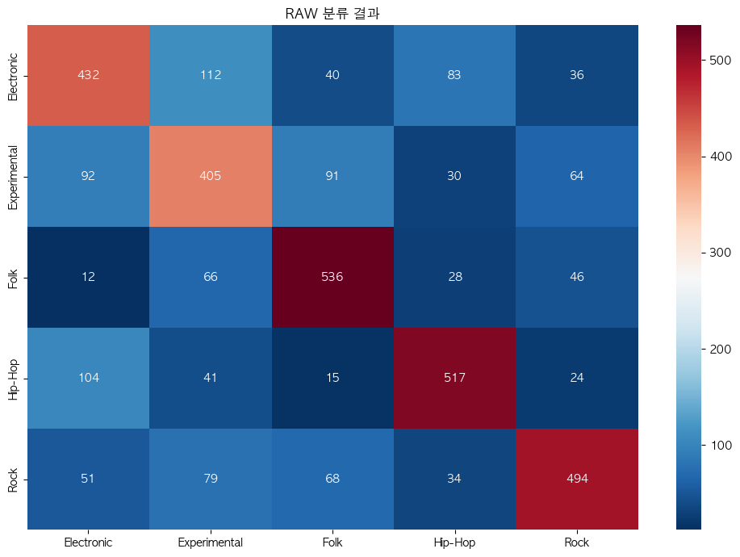
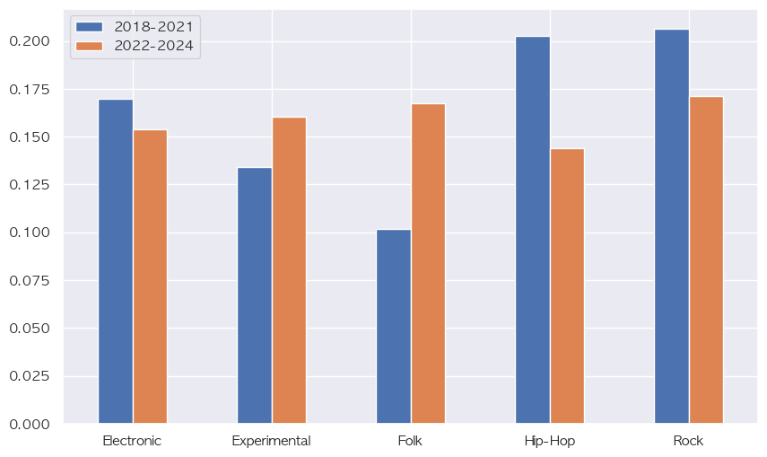

# "이것은 국힙위상이 왜 이렇게 떨어졌는가." 시작된 프로젝트

## 한 것

### 1. 음악 이용자 실태조사 데이터를 분석
- Data :
    - 한국콘텐츠진흥원
    - 2019 ~ 2023 음악 이용자 실태 조사

- 결론
    - 국힙의 위상이 떨어진 것은 사실
    - 음악 시장 자체의 파이가 상당히 줄어들었다.    

- Why :
    - 영상매체를 사운드로 소비하는 문화

### 2. 국내힙합의 장르 변화

- Data:
    - fma
        - 음악 데이터 45000개 정도
        - chroma related ~ mfcc ~ spectral ~ tonnetz ~ zcr
    - 국힙 데이터
        - 힙합어워드 수상작 중 개인적인 선택
        - 2018 ~ 2024 음악 작품 mp3

- 분석 1차
    - PCA / Clustering
        - 시각화 
        - 장르의 유사성 판단

- 분석 2차
    - 5개 장르로 음악 구분 
        - acc : .68
        
    - 3개 장르(hiphop / experimental / etcs) 음악 구분
        - acc : .73
        - 이것의 이유는 experiemental화 되는 음악 장르는 점점 대중에서 멀어진다는 적절한 근거를 제시한 영상을 봄
        

    - 2개 장르(hiphop / not-hiphop) 음악 구분
        - acc : .83
        

국내힙합의장르구분.ipynb